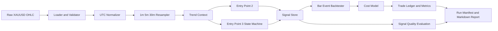
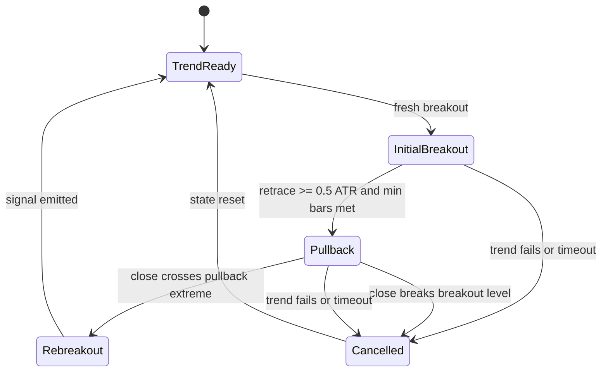

# XAUUSD 多周期入场识别与研究回测系统

本文档把两张策略示意图收敛成一个可复现的研究系统。第一版只面向历史数据研究和回测，不连接实盘账户，不自动下单，也不把回测结果解释为投资建议。

## Goal Capsule

- **目标:** 对 XAUUSD 历史 K 线识别多周期顺势入场点，首先实现入场点2，再实现入场点3，并在统一的数据、成本和执行口径下比较两者。
- **核心产出:** 可复现的信号文件、交易明细、统计报告、运行元数据和数据质量警告。
- **首要价值:** 把“看图判断买点”变成没有未来函数、可以逐条解释、可以批量回测的规则系统。
- **默认交易方向:** 同时支持做多和做空；图示中的下跌做空逻辑必须与做多逻辑保持镜像。
- **默认品种:** XAUUSD 现货/CFD 历史价格。系统不依赖集中式真实成交量，也不把现货数据直接当作 COMEX 或上期所期货数据。
- **默认周期:** 基础执行周期 1 分钟，中级别 5 分钟，大级别 30 分钟。三者必须从同一份原始数据按统一时区重采样得到。
- **停止条件:** 任一运行存在未处理的数据缺口、时间戳重复、OHLC 关系非法、未明确成本模型或可能使用未来 K 线时，运行必须失败或明确标记为不可用于研究结论。
- **审阅重点:** 价格来源与交易场所、基准参数、入场点3的回调定义、成本模型和退出规则是本方案的主要可调整点。

## Product Contract

### Summary

研究者提供一份带来源元数据的 XAUUSD OHLC 数据和一份策略配置。系统完成数据校验、周期重采样、多周期趋势过滤、入场点识别、基础交易模拟和结果报告。每个信号都必须能回溯到产生它的 K 线、趋势状态、突破水平、ATR、成本参数和策略版本。

### Problem Frame

当前策略描述依赖人工识别“大级别、中级别、小级别”的方向，以及“突破”“回调”“反转”等图形概念。人工判断难以批量验证，也容易出现两个研究错误：一是用事后确认的摆动点产生未来函数，二是把不同数据源、不同时间边界和不同点差口径的结果放在一起比较。

第一版不试图还原所有主观盘感，而是建立一个清晰的基线：用固定的 EMA 趋势过滤和已完成 K 线的突破规则识别入场点2；用显式状态机识别“初始突破、回调、二次突破”的入场点3。基线稳定后，再通过独立实验增加结构识别或优化参数。

### Actors

- **策略研究者:** 配置品种、周期、策略和成本，运行历史研究，比较入场点2与入场点3。
- **数据维护者:** 提供原始 XAUUSD 文件，确认价格基准、时区、来源和数据覆盖范围，处理数据质量警告。
- **未来执行集成者:** 未来可能把已验证信号接入指定经纪商或期货账户；该角色不属于第一版运行链路。

### Requirements

#### Data and instrument

- R1. 系统必须读取至少包含 `timestamp`、`open`、`high`、`low`、`close` 的 OHLC 数据；`volume` 为可选字段，不得成为第一版信号的必要条件。
- R2. 每份数据必须携带来源元数据：`provider`、`symbol`、`price_basis`、原始时间区间、原始周期、时区、文件指纹和获取时间。缺少来源元数据时，系统可以执行纯单元测试，但不得生成可用于研究结论的正式运行报告。
- R3. 系统必须校验时间戳可解析、统一转换为 UTC、严格递增且不重复；价格必须为正数，并满足 `high >= max(open, close)` 和 `low <= min(open, close)`。
- R4. 系统不得默认填补缺失 K 线。缺口必须被记录为数据质量事件，并由配置决定是阻断运行还是允许运行但在报告中标红。
- R5. 系统必须支持 CSV 和 Parquet 两种本地输入格式。第一版不把某一家数据商的下载 API 写死在策略代码中，数据商接入必须位于独立适配层。
- R6. 系统必须从同一份原始数据生成 1 分钟、5 分钟和 30 分钟序列。重采样边界固定使用 UTC，并只输出完整的高周期 K 线。
- R7. 系统必须区分 `mid`、`bid`、`ask` 三种价格基准。若输入只有单一价格序列，成本模型必须明确说明如何近似买卖价差。

#### Trend and signal identification

- R8. 系统必须支持 `long`、`short` 和 `both` 三种方向模式，并保证做多与做空规则在字段、时间和执行逻辑上成镜像关系。
- R9. 每个周期的基线趋势状态必须由同周期指标计算：`EMA(20)`、`EMA(60)` 和 `EMA(60)` 相对 5 根已完成 K 线前的斜率。
- R10. 基线多头趋势必须同时满足 `EMA20 > EMA60`、`EMA60 > EMA60.shift(5)` 和 `close > EMA20`；空头趋势使用严格反向条件。指标参数必须可配置，但基线运行不得自动优化参数。
- R11. 入场点2必须要求大级别、中级别和小级别趋势同向，并要求小级别收盘价突破前 20 根已完成小级别 K 线的最高价或最低价。突破必须是新突破，而不是价格已经在突破位上方后重复发出的信号。
- R12. 入场点2的信号确认发生在小级别 K 线收盘时，成交时间默认是下一根基础周期 K 线的开盘；若下一根 K 线不存在，信号必须标记为未成交。
- R13. 入场点3必须由有限状态机识别，不得通过事后扫描未来摆动点来标注。多头状态依次为趋势就绪、初始突破、等待回调、等待二次突破；空头状态为镜像状态。
- R14. 入场点3的基线回调必须满足：初始突破后价格从突破后的最高点至少回撤 `0.5 * ATR(14)`，回调至少持续 2 根基础周期 K 线，且收盘价没有跌破初始突破位。回调结束后，收盘价重新突破回调阶段的最高价才产生买入信号；做空方向严格反向。
- R15. 入场点3必须支持 setup 失效条件：收盘价破坏初始突破位、大中级别趋势失效、setup 超过 30 根基础周期 K 线，或数据缺失导致状态无法连续推进。
- R16. 在同一品种同一方向已有持仓时，默认不重复开仓、不加仓；信号识别结果和持仓执行结果必须分开保存，不能因为持仓过滤而丢失原始候选信号。
- R17. 每个信号必须携带可解释字段：`strategy_id`、`side`、`signal_time`、`entry_time`、各周期趋势状态、突破位、回调状态、ATR、触发原因、取消原因和数据质量标记。

#### Backtest and cost model

- R18. 回测执行必须使用事件顺序：信号 K 线收盘确认，下一根基础周期 K 线开盘成交；不得使用信号 K 线收盘价同时作为成交价，除非运行明确选择理想化研究模式并在报告中标记。
- R19. 第一版必须显式建模点差和滑点。单一中间价输入使用配置的固定点差或逐 K 线点差字段近似买卖价；多空成交方向必须正确使用 bid/ask。
- R20. 基线退出规则为：入场价外 `2 * ATR(14)` 的止损、入场价外 `4 * ATR(14)` 的止盈、最多持有 80 根基础周期 K 线。止损和止盈同一根 K 线同时触发时，按止损先触发处理。
- R21. 若开盘价已经越过止损位，必须按实际可实现的开盘价成交，而不是按止损价成交；所有退出都必须记录 `exit_reason`。
- R22. 回测必须输出毛收益、点差成本、滑点成本、手续费、净收益、R 倍数、最大有利波动 MFE、最大不利波动 MAE、持仓时间和最大回撤。第一版不做杠杆、保证金和账户级组合分配。
- R23. 运行必须支持只做信号质量评估而不生成交易，至少统计信号后 5、10、20、40 根基础周期的收益分布和 MAE/MFE，以便区分“入场识别质量”和“退出规则效果”。

#### Reporting and reproducibility

- R24. 每次运行必须生成运行清单，记录代码版本或工作区指纹、配置指纹、数据指纹、输入区间、策略版本、成本模型、时区和所有警告。
- R25. 每次运行至少生成信号文件、交易明细文件、汇总指标文件和人类可读的 Markdown 报告。图表为可选增强，不得成为判断运行是否完成的唯一依据。
- R26. 相同数据、相同配置和相同代码指纹重复运行时，信号、交易明细和指标必须一致；随机抽样、随机优化和随机数据切分不属于第一版。
- R27. 报告必须分别展示入场点2和入场点3，且允许在完全相同的日期范围、数据版本和成本模型下进行并列比较。
- R28. 报告必须区分代码验收和策略有效性。测试全部通过不等同于策略盈利；策略有效性必须通过样本外区间、不同年份和不同成本假设进行独立研究判断。

### Key Flows

- F1. **数据导入与校验**
  - **Trigger:** 研究者提交本地 XAUUSD CSV 或 Parquet 文件及数据元信息。
  - **Steps:** 读取文件、规范列名、统一 UTC、校验 OHLC、检测缺口、生成多周期序列、保存数据摘要。
  - **Outcome:** 得到可供策略使用的标准化时间序列，或得到带具体原因的阻断错误。
  - **Covered by:** R1-R7, R24.

- F2. **入场点2信号识别**
  - **Trigger:** 研究者选择 `entry_point_2` 和方向模式。
  - **Steps:** 计算各周期 EMA 趋势、将最近一根已完成高周期状态对齐到基础周期、计算前 20 根已完成 K 线突破位、在基础周期收盘确认新突破。
  - **Outcome:** 输出候选信号，并把成交时间推迟到下一根基础周期开盘。
  - **Covered by:** R8-R12, R17-R18.

- F3. **入场点3状态机识别**
  - **Trigger:** 研究者选择 `entry_point_3`。
  - **Steps:** 识别初始突破、跟踪突破后的高低点、确认 ATR 回调、等待二次突破、处理失效和超时。
  - **Outcome:** 输出一个带完整状态转换记录的二次突破信号，或输出 setup 取消原因。
  - **Covered by:** R13-R17.

- F4. **统一口径的研究运行**
  - **Trigger:** 研究者提交一个或多个策略配置。
  - **Steps:** 使用相同数据切片和成本模型运行信号评估与基础回测，生成信号、交易、指标和运行清单。
  - **Outcome:** 可以比较入场点2和入场点3，而不把数据或执行差异误判为策略差异。
  - **Covered by:** R18-R28.

### Acceptance Examples

- AE1. **有效数据可导入**
  - **Given:** 一份 UTC 或带明确时区的 XAUUSD OHLC 文件，时间戳唯一且 OHLC 关系合法。
  - **When:** 运行数据导入和重采样。
  - **Then:** 生成标准化 1m、5m、30m 序列，元数据中保留来源和文件指纹，并报告覆盖区间。
  - **Covers:** R1-R7.

- AE2. **数据错误被阻断或显式警告**
  - **Given:** 文件包含重复时间戳、非法高低价或超过配置阈值的缺口。
  - **When:** 执行正式研究运行。
  - **Then:** 系统按配置阻断运行，或完成运行但将对应警告写入报告；不得静默修复并继续。
  - **Covers:** R3-R4, R16, R24.

- AE3. **入场点2只在新突破时触发**
  - **Given:** 大中小三个周期趋势均满足多头条件，小级别当前收盘价高于前 20 根已完成 K 线最高价，且上一根尚未突破。
  - **When:** 当前小级别 K 线收盘。
  - **Then:** 产生一个多头候选信号，成交时间为下一根基础周期开盘；如果连续几根 K 线都在突破位上方，不重复产生信号。
  - **Covers:** R9-R12, R16-R18.

- AE4. **入场点3完整走完回调状态**
  - **Given:** 初始多头突破已经确认，价格从突破后高点回撤至少 `0.5 ATR`，回调持续 2 根以上且没有收盘跌破初始突破位。
  - **When:** 当前收盘价重新突破回调阶段最高价。
  - **Then:** 状态机产生一个二次突破信号，成交推迟到下一根基础周期开盘。
  - **Covers:** R13-R15, R17-R18.

- AE5. **未来数据不会改变既有信号**
  - **Given:** 一份完整历史数据和一份只在某个信号时间之后被修改的历史数据。
  - **When:** 分别运行到该信号时间。
  - **Then:** 修改发生之前的趋势状态、信号时间、突破位和 setup 状态完全一致。
  - **Covers:** R6, R10-R15, R18, R26.

- AE6. **多空逻辑保持镜像**
  - **Given:** 对称构造的上涨和下跌价格序列。
  - **When:** 分别使用 `long` 和 `short` 运行相同策略。
  - **Then:** 信号条件、状态转换、成本方向和止盈止损距离呈镜像关系，字段结构保持一致。
  - **Covers:** R8, R10-R15, R19-R22.

- AE7. **成本模型真实影响结果**
  - **Given:** 同一组信号分别使用零点差和非零固定点差运行。
  - **When:** 执行基础回测。
  - **Then:** 交易数量和信号时间不变，净收益、成本字段和净收益曲线发生可解释变化；报告标明两次运行的成本配置不同。
  - **Covers:** R19-R22, R24-R27.

- AE8. **重复运行可复现**
  - **Given:** 数据文件、配置文件和代码指纹不变。
  - **When:** 重复执行同一运行。
  - **Then:** 运行清单、信号、交易和汇总指标一致，输出目录中的文件指纹可比对。
  - **Covers:** R24-R26.

### Scope Boundaries

#### In scope

- XAUUSD 历史 OHLC 数据导入、校验、UTC 规范化和多周期重采样。
- 多周期 EMA 趋势过滤。
- 入场点2的顺大顺中顺小突破识别。
- 入场点3的初始突破、ATR 回调和二次突破状态机。
- 做多、做空、信号质量评估和基础单品种回测。
- 固定或逐 K 线点差、滑点、手续费的显式成本建模。
- 可复现的信号、交易、指标和 Markdown 报告。

#### Deferred for later

- 具体数据商的自动下载 API；第一版先使用带元数据的本地文件适配器。
- COMEX `GC`/`MGC` 和上期所 `AU` 的合约换月、交易日历、保证金和合约乘数。
- 隔夜利息、融资费、swap 和经纪商特定的交易限制。
- 自动参数优化、机器学习、遗传算法和策略组合。
- 自动识别更主观的“三推反转”和“中级别防守位抢先入场”。
- 实盘下单、账户同步、风险限额、告警和无人值守运行。

#### Outside this product's identity

- 自动给出投资建议或保证收益。
- 把单一数据商的历史结果宣称为所有黄金市场的普遍结论。
- 在未经样本外验证和实际交易成本校准前连接真实账户。

### Review Focus

下列内容是建议默认值，而不是不可改变的业务事实。审阅时如果修改，应同步修改相应的 R、KTD、配置和测试场景。

| Decision | Proposed default | Why it matters |
|---|---|---|
| Instrument | XAUUSD spot/CFD historical data | 直接支持多空，避免第一版处理期货换月；但必须最终使用实际执行场所的数据复核 |
| Raw source | Local CSV/Parquet with provider metadata | 让策略和数据商解耦，先验证规则，不被 API 凭证和供应商差异阻塞 |
| Timeframes | 1m / 5m / 30m | 用于更细粒度的基础执行、中级别和大级别方向判断 |
| Entry point 2 | Same-direction EMA filters plus fresh 20-bar breakout | 最容易复现，适合作为基线 |
| Entry point 3 | Initial breakout, 0.5 ATR pullback, 2-bar minimum, re-breakout | 将“回调后再次顺势”转化为有限状态机 |
| Baseline exits | 2 ATR stop, 4 ATR target, 80 base bars timeout | 形成可比较的研究闭环，不把复杂退出逻辑混入入场验证 |
| Volume | Not required | XAUUSD spot/CFD 没有统一的集中式真实成交量 |

## Planning Contract

### Key Technical Decisions

- KTD1. **第一版采用研究优先边界。** 系统只生成可审计的历史信号和模拟交易，不保存账户凭证、不提交订单、不承诺实盘可用。这样可以先验证规则、数据口径和未来函数控制，避免把执行风险与策略研究问题混在一起。

- KTD2. **策略代码使用供应商无关的标准化数据契约。** 具体数据商放在数据适配层，策略只消费标准化 OHLC 和来源元数据。这样可以用本地样本快速开发，也能在后续使用实际经纪商数据复核，不需要重写信号逻辑。

- KTD3. **所有周期从同一份原始序列派生，内部统一 UTC。** 不允许分别加载来源不同的 1m、5m、30m 文件进行拼接。高周期状态只能使用在信号 K 线收盘前已经完成的高周期 K 线，避免边界差异和未来函数。

- KTD4. **使用规则引擎与有限状态机，而不是事后摆动点标注。** 入场点2的突破规则直接由已完成 K 线计算；入场点3逐根推进状态。任何依赖未来右侧 K 线确认的摆动点算法只能作为离线分析工具，不能进入正式信号路径。

- KTD5. **先实现入场点2，再实现入场点3。** 入场点2能提供最小可用闭环，便于先验证数据、周期对齐、成交时序和报告；入场点3复用同一趋势上下文和执行层，只新增 setup 状态逻辑。

- KTD6. **信号识别与交易执行分层。** 信号引擎只回答“何时、为何产生候选入场”；回测执行层回答“是否持仓、以何价成交、如何退出”。这样可以在不改变入场规则的情况下比较不同退出或成本模型。

- KTD7. **第一版采用确定性的逐基础周期事件处理。** 计算指标可以使用向量化数据处理，但 setup 状态、持仓、止损止盈和同 K 线冲突必须按时间顺序处理。这样比全量向量化更容易表达状态机和开盘成交规则。

- KTD8. **参数可配置但不自动优化。** 默认参数写入版本化配置，研究运行记录完整配置指纹。第一版允许人工运行参数对照实验，但不提供自动搜索，以免在没有样本外流程的情况下把过拟合误当成策略改进。

### High-Level Technical Design



#### Data model

- `Bar`: UTC close time、OHLC、可选成交量、价格基准和数据质量标记。
- `TimeframeSeries`: 一个来源一致、边界一致、只含完整 K 线的周期序列。
- `TrendContext`: 在某个基础周期信号时间可见的大、中、小级别 EMA 和趋势方向。
- `SignalCandidate`: 原始候选信号，不受当前持仓过滤影响。
- `SetupState`: 入场点3的方向、阶段、突破位、极值、回调起点、超时计数和取消原因。
- `Trade`: 实际模拟成交后的入场、退出、成本、MFE、MAE 和结果。
- `RunManifest`: 数据、配置、代码、策略、成本和警告的可复现元数据。

#### Signal timing contract

以基础周期 K 线 `B_t` 为例：

1. 在 `B_t` 收盘时计算当前基础周期指标和小级别突破条件。
2. 对 5m 和 30m，只读取 `close_time <= B_t.close_time` 的最近完整高周期 K 线。
3. 若条件成立，写入 `signal_time = B_t.close_time`。
4. 默认写入 `entry_time = B_(t+1).open_time`，成交价由成本模型计算。
5. 若 `B_(t+1)` 缺失，保留候选信号但不生成成交，并记录 `unfilled_reason`。

#### Entry point 2 rule

多头在基础周期收盘时满足以下条件才产生信号：

```text
trend_30m == UP
and trend_5m == UP
and trend_1m == UP
and close_t > max(high[t-20 : t-1])
and close_(t-1) <= max(high[t-21 : t-2])
```

空头使用完全镜像的最低价和小于关系。突破水平必须排除当前 K 线，上一根 K 线的突破状态也必须用当时可见的突破水平判断。策略在持仓期间仍可记录候选信号，但回测执行层默认过滤重复持仓。

#### Entry point 3 state machine



实现必须保存每次状态转换的时间和原因。多头使用突破后最高点、回调阶段最高价和向上二次突破；空头使用对应的最低点和向下二次突破。状态机只能向前读取数据，不能使用未来确认的 pivot。

#### Backtest execution contract

- 每个品种最多一个活动仓位，禁止加仓和金字塔加仓。
- 入场成交价根据价格基准和点差方向计算；单一中间价输入时，点差近似必须写入运行清单。
- 止损、止盈和超时退出均在基础周期逐根处理。
- 同一根 K 线同时触及止损和止盈时，使用保守的止损优先规则；如果开盘已经跳过止损，使用开盘价。
- 回测输出以单单位收益和 R 倍数为主，不模拟账户杠杆、保证金或合约乘数。
- 信号质量评估单独计算固定未来窗口收益，不与持仓交易结果混在同一张表中。

### Proposed Project Structure

当前工作区没有既有代码库，因此以下是建议的绿色项目结构，所有路径均为项目相对路径：

```text
pyproject.toml
configs/
  xauusd_baseline.toml
src/
  gold_research/
    cli.py
    config.py
    domain.py
    data/
      loader.py
      normalize.py
      validate.py
      resample.py
    strategy/
      indicators.py
      timeframe_context.py
      entry_point_2.py
      entry_point_3.py
      state_machine.py
    backtest/
      execution.py
      costs.py
      metrics.py
    reporting/
      artifacts.py
      markdown_report.py
tests/
  fixtures/
    xauusd_synthetic.csv
    xauusd_boundary_cases.csv
  test_data_contract.py
  test_resampling.py
  test_timeframe_context.py
  test_entry_point_2.py
  test_entry_point_3.py
  test_backtest_execution.py
  test_reproducibility.py
data/
  README.md
runs/
  .gitkeep
```

### Configuration Contract

基线配置建议使用 TOML，避免第一版为了配置引入额外 DSL。配置至少包含：

```toml
[instrument]
symbol = "XAUUSD"
price_basis = "mid"

[timeframes]
base = "1min"
medium = "5min"
large = "30min"
timezone = "UTC"

[trend]
ema_fast = 20
ema_slow = 60
slope_lookback = 5

[entry_point_2]
enabled = true
breakout_lookback = 20

[entry_point_3]
enabled = true
pullback_min_atr = 0.5
pullback_min_bars = 2
max_setup_bars = 30

[risk]
atr_period = 14
stop_atr = 2.0
target_atr = 4.0
max_hold_bars = 80

[costs]
spread_model = "fixed"
spread_value = 0.0
slippage_model = "fixed"
slippage_value = 0.0
commission_per_unit = 0.0
require_explicit_costs = true

[data_quality]
missing_bar_policy = "block"
max_gap_bars = 0
```

`spread_value = 0.0` 只适合纯逻辑测试。正式研究运行必须使用实际或保守估计的点差、滑点，并在报告中明确这是估计值还是逐 K 线实测字段。

## Implementation Units

### U1. Domain contracts, configuration, and project skeleton

- **Goal:** 建立标准化领域对象、配置读取、策略标识和运行清单契约，使后续模块不直接依赖原始 DataFrame 的隐含字段。
- **Files:** `pyproject.toml`, `src/gold_research/domain.py`, `src/gold_research/config.py`, `src/gold_research/cli.py`, `configs/xauusd_baseline.toml`, `tests/test_data_contract.py`。
- **Approach:** 使用轻量数据类和显式字段校验；配置加载后生成不可变的运行配置对象；所有运行 ID、策略 ID 和方向值使用受限枚举或明确字符串集合。
- **Test scenarios:**
  - 合法配置能读取默认周期、趋势和退出参数。
  - 缺少 symbol、timezone、price basis 或成本字段时，正式运行配置加载失败。
  - 非法方向、负数周期参数、`stop_atr <= 0` 和 `target_atr <= stop_atr` 被拒绝。
  - 运行清单能保存配置指纹、数据指纹和策略版本。
- **Verification:** 后续所有单元只依赖这个契约，不允许在策略模块中重新解释配置字段。

### U2. Historical data loading, validation, and resampling

- **Goal:** 将 CSV/Parquet 输入转换为统一 UTC、质量可追踪的 1m/5m/30m 序列。
- **Files:** `src/gold_research/data/loader.py`, `src/gold_research/data/normalize.py`, `src/gold_research/data/validate.py`, `src/gold_research/data/resample.py`, `tests/fixtures/xauusd_synthetic.csv`, `tests/fixtures/xauusd_boundary_cases.csv`, `tests/test_resampling.py`。
- **Approach:** loader 只负责读取，normalize 只负责字段和时区，validate 只负责质量判定，resample 只处理周期边界；禁止用隐式前向填充制造缺失 K 线。
- **Test scenarios:**
  - naive timestamp 在元数据指定时区后能正确转成 UTC；缺少时区时正式运行失败。
  - 重复时间戳、非法 OHLC、非正价格、未排序时间戳得到稳定错误码。
  - 跨 5m 和 30m 边界的样本只生成完整高周期 K 线，聚合 OHLC 结果正确。
  - 缺失基础周期 K 线不会被自动补齐，缺口事件包含开始时间、结束时间和缺口长度。
  - CSV 和 Parquet 对同一数据产生一致的标准化结果。
- **Verification:** 使用边界 fixture 检查夏令时或供应商日界线差异不会改变内部 UTC 结果；不能把不同来源的高周期文件混入同一运行。

### U3. Multi-timeframe trend context without look-ahead

- **Goal:** 计算各周期 EMA 趋势，并把已完成的 5m/30m 状态安全对齐到基础周期收盘。
- **Files:** `src/gold_research/strategy/indicators.py`, `src/gold_research/strategy/timeframe_context.py`, `tests/test_timeframe_context.py`。
- **Approach:** 指标在各自完整周期序列上计算；使用显式的时间对齐函数，不使用事后 pivot；每一行趋势上下文保存来源高周期 K 线的结束时间，方便审计。
- **Test scenarios:**
  - EMA20、EMA60 和 slope lookback 使用同周期数据，初始 warm-up 区间不产生趋势信号。
  - 基础周期信号只能看到已经收盘的高周期 K 线。
  - 修改一个信号时间之后的 30m K 线不会改变之前的趋势上下文。
  - 大中小周期任一趋势为 `UNKNOWN` 时，入场条件不成立而不是默认为多头或空头。
  - 多头与空头趋势条件对同一对称价格序列产生镜像结果。
- **Verification:** 执行未来数据扰动测试，确保历史前缀输出字节级一致或字段级完全一致。

### U4. Entry point 2 breakout signal engine

- **Goal:** 实现最简单、最可解释的顺大顺中顺小新突破识别。
- **Files:** `src/gold_research/strategy/entry_point_2.py`, `tests/test_entry_point_2.py`。
- **Approach:** 在每个基础周期收盘判断趋势上下文和前 N 根已完成 K 线的突破水平；将信号产生与持仓过滤分离；信号对象携带完整触发条件快照。
- **Test scenarios:**
  - 三周期多头趋势成立且当前收盘新突破 20-bar high 时产生唯一多头信号。
  - 当前价格连续停留在突破位上方时不重复产生信号。
  - 上一根已经突破但当前趋势仍成立时不产生新的 fresh breakout。
  - 空头跌破 20-bar low 的逻辑与多头镜像。
  - 趋势过滤缺失、突破只有影线而收盘未突破、warm-up 不足时不产生信号。
  - 信号时间为当前基础 K 线收盘，成交时间为下一根基础 K 线开盘。
  - 修改未来 K 线不会影响信号时间之前的结果。
- **Verification:** 对合成数据逐根核对信号 reason、breakout level 和 trend source timestamps；禁止通过 `shift(-1)` 或事后 pivot 生成正式信号。

### U5. Entry point 3 pullback and re-breakout state machine

- **Goal:** 将“顺势初始突破后回调，再次顺势突破”实现为可审计的有限状态机。
- **Files:** `src/gold_research/strategy/entry_point_3.py`, `src/gold_research/strategy/state_machine.py`, `tests/test_entry_point_3.py`。
- **Approach:** 每个方向维护独立 setup；状态转换只由当前基础周期收盘事件推进；保存 setup 的起点、突破位、极值、回调起点、ATR、已持续 bars 和取消原因。
- **Test scenarios:**
  - 初始突破只创建 setup，不立即产生入场点3交易信号。
  - 回撤未达到 `0.5 ATR` 时不进入有效回调状态。
  - 回调少于 2 根基础 K 线时不触发二次突破。
  - 回调收盘跌破初始突破位时 setup 立即取消。
  - 回调有效且当前收盘重新突破回调极值时产生一次二次突破信号。
  - 趋势失效、缺口、超过 30 bars 时取消 setup 并记录 reason。
  - 同一 setup 不重复发出多个二次突破信号；新的 setup 必须有新的初始突破。
  - 做空状态机与做多状态机在对称数据上产生镜像状态序列。
- **Verification:** 保存状态转换日志并用 fixture 逐状态断言；任何需要右侧未来 K 线确认的摆动点实现都不得作为依赖。

### U6. Deterministic bar-event backtester and cost model

- **Goal:** 在不改变信号规则的前提下，以统一成交时序和成本口径生成基础交易结果。
- **Files:** `src/gold_research/backtest/execution.py`, `src/gold_research/backtest/costs.py`, `src/gold_research/backtest/metrics.py`, `tests/test_backtest_execution.py`。
- **Approach:** 按基础周期逐根处理候选信号、持仓、开盘成交、盘中止损/止盈和超时退出；成本模型独立注入；所有冲突规则固定并记录。
- **Test scenarios:**
  - 信号在 K 线收盘产生，下一根开盘成交；不存在下一根 K 线时不生成交易。
  - 多头入场使用 ask 方向、空头入场使用 bid 方向，退出方向相反。
  - 零成本与非零成本运行的信号数量相同，但净收益不同。
  - 开盘跳过止损时按开盘价退出。
  - 同一根 K 线同时触及止损和止盈时按止损优先。
  - 80 根基础 K 线达到时按 timeout 退出，持仓不无限延长。
  - 已有持仓时候选信号仍写入信号文件，但不生成重复交易。
  - MFE、MAE、毛收益、成本和净收益能由交易过程重新计算。
- **Verification:** 使用手工可计算的最小 fixture 做逐笔结果断言；不接受仅通过向量化收盘价差得到的回测实现。

### U7. Run artifacts, reports, CLI, and reproducibility checks

- **Goal:** 让研究者可以用一个配置运行策略，并得到可比较、可审计的结果包。
- **Files:** `src/gold_research/reporting/artifacts.py`, `src/gold_research/reporting/markdown_report.py`, `src/gold_research/cli.py`, `tests/test_reproducibility.py`, `data/README.md`。
- **Approach:** 每次运行写入独立目录，目录包含 `manifest.json`、`signals.csv` 或 Parquet、`trades.csv`、`metrics.json`、`report.md` 和 `warnings.json`；CLI 支持运行单个策略或按同一数据配置比较两个策略。
- **Test scenarios:**
  - 完整运行生成所有必需文件，报告包含数据区间、成本模型和警告。
  - 相同输入重复运行输出一致的文件指纹和指标。
  - 入场点2和入场点3使用相同数据切片和成本配置时，报告分别列出结果。
  - 缺失成本或来源元数据时，正式报告被阻断或明确标记不可用于研究结论。
  - CLI 参数错误返回非零退出码并给出可理解的错误信息。
- **Verification:** 运行 smoke fixture，从输入到 Markdown 报告完整走通；人工抽查一条信号能够追溯到原始 K 线和对应策略条件。

## Verification Contract

### Automated checks

| Gate | Expected evidence | Applies to |
|---|---|---|
| Data contract | 合法/非法输入测试通过，错误码稳定 | U1, U2 |
| Resampling | 同源数据生成的 1m/5m/30m 边界测试通过 | U2 |
| Look-ahead safety | 未来数据扰动不改变历史前缀信号和趋势上下文 | U3, U4, U5 |
| Entry point 2 | 新突破、重复突破、长短镜像和 warm-up 测试通过 | U4 |
| Entry point 3 | 状态转换、取消、超时、二次突破和镜像测试通过 | U5 |
| Execution | 下一根开盘、成本、跳空、冲突处理和退出测试通过 | U6 |
| Reproducibility | 相同输入得到相同 manifest、signals、trades、metrics | U7 |
| End-to-end smoke | 合成 XAUUSD 数据从导入到报告完整运行 | U1-U7 |

### Research validation gates

这些是策略研究门槛，不是代码单元测试的替代品：

- 至少按年份或明确日期切分训练/验证/样本外区间，不使用同一段数据选择参数后再宣称样本外有效。
- 在同一数据上比较入场点2和入场点3时，保持成本、退出、持仓限制和评价窗口一致。
- 至少使用零成本、保守固定成本和更高成本三组假设，检查优势是否只在理想化成本下存在。
- 分别检查信号数量、每次信号后的固定窗口收益、交易净收益、最大回撤、MAE/MFE 和年度稳定性。
- 明确记录数据商、价格基准和交易时段；不同来源的 XAUUSD 结果只能作为不同数据集比较，不得无说明地合并。
- 任何发现只能在样本外和成本校准完成后进入“候选策略”，不能因为回测盈利自动进入实盘。

### Expected commands

项目实现后应提供以下等价能力，具体命令形式可以按实际 CLI 调整：

```text
python -m pytest
python -m gold_research.cli validate-data --config configs/xauusd_baseline.toml --input <data-file>
python -m gold_research.cli run --config configs/xauusd_baseline.toml --input <data-file> --strategy entry_point_2
python -m gold_research.cli run --config configs/xauusd_baseline.toml --input <data-file> --strategy entry_point_3
```

正式运行命令必须在输出中显示实际解析后的配置、数据区间和成本模型，避免只看命令参数而误解运行口径。

## Definition of Done

- U1-U7 的实现文件和对应测试文件齐全，测试通过。
- XAUUSD CSV/Parquet 能被标准化为统一 UTC 的 1m、5m、30m 序列，并能阻断或显式报告数据质量问题。
- 入场点2能输出做多和做空的新突破候选信号，成交严格推迟到下一根基础周期开盘。
- 入场点3能输出完整状态转换日志，并正确处理有效回调、失效、超时和二次突破。
- 未来数据扰动测试通过，历史前缀信号不会变化。
- 基础回测能正确处理点差、滑点、止损、止盈、超时、跳空和同 K 线冲突。
- 每次运行生成 manifest、signals、trades、metrics、warnings 和 Markdown 报告，并能重复运行得到一致结果。
- 报告明确区分入场点2、入场点3、信号质量评估和交易回测结果。
- 文档和配置明确说明 XAUUSD 数据来源、价格基准、成本假设和研究限制。
- 系统仍然不包含实盘账户连接、自动下单、杠杆管理或未经审阅的参数优化。

## Appendix

### Risks and mitigations

| Risk | Consequence | Mitigation |
|---|---|---|
| 供应商价格、点差和时间边界不同 | 同一规则的结果不可直接比较 | 保存来源元数据，统一 UTC，先用同一来源完成比较 |
| 高周期 K 线未收盘就被用于低周期信号 | 产生未来函数，回测虚高 | 只允许完整高周期 K 线，增加未来扰动测试 |
| 事后 pivot 或三推识别进入信号路径 | 历史信号无法实时复现 | 入场点3使用逐根状态机，禁止右侧确认依赖 |
| XAUUSD 现货没有统一真实成交量 | 量价指标跨平台失真 | 第一版不依赖 volume，后续若使用必须标记来源和语义 |
| 点差和滑点被设为零 | 交易频繁策略结果过度乐观 | 正式运行要求显式成本，报告展示成本敏感性 |
| 只在单一行情阶段验证 | 策略可能只适应特定波动环境 | 按年份、波动状态和样本外区间分层检查 |
| 基础周期缺口或市场休市 | 状态机错误推进或成交时间不存在 | 缺口事件进入状态机，缺失下一根 K 线的信号不成交 |
| 退出规则掩盖入场规则差异 | 无法判断入场点2/3本身质量 | 同时输出固定窗口信号质量和统一退出的交易结果 |

### Data source policy

第一版研究输入采用本地 CSV/Parquet，不绑定具体供应商。数据维护者必须在元数据中填写实际来源。若最终执行 XAUUSD 现货/CFD，应优先使用目标经纪商的历史报价和实际点差校准；若改为 COMEX 或上期所黄金期货，应新建对应的数据适配器和合约规则，不得直接复用现货回测结果作为执行结论。

### Glossary

- **基础周期:** 实际产生信号并模拟下一根开盘成交的周期，默认 1 分钟。
- **中级别:** 默认 5 分钟趋势过滤周期。
- **大级别:** 默认 30 分钟趋势过滤周期。
- **已完成 K 线:** 在当前信号时间之前已经收盘、其 OHLC 不会再变化的 K 线。
- **新突破:** 当前收盘首次越过由前 N 根已完成 K 线计算出的突破水平。
- **setup:** 入场点3从初始突破开始，到二次突破或失效结束的一段状态生命周期。
- **信号质量评估:** 不模拟持仓，只观察信号后固定未来窗口的收益、MAE 和 MFE。
